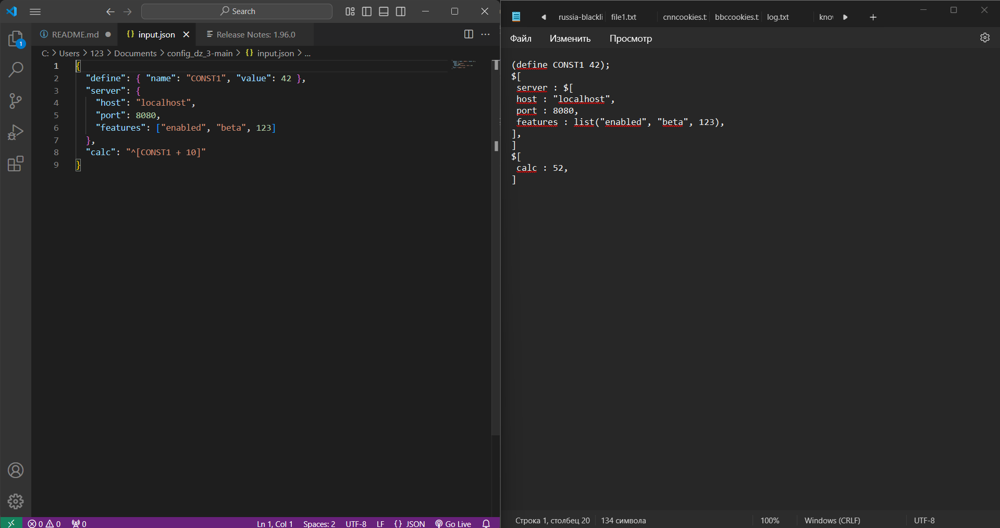
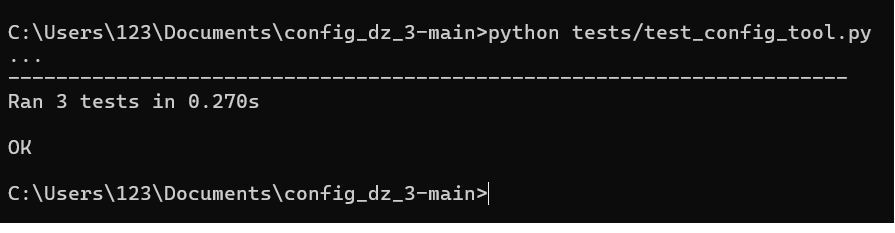

# Конвертер JSON в учебный конфигурационный язык

## Общее описание

Этот проект представляет собой инструмент командной строки, который преобразует файлы в формате JSON в текст на учебном конфигурационном языке. 

Конвертер поддерживает:
- Однострочные комментарии.
- Многострочные комментарии.
- Словари.
- Имена.
- Значения.
- Объявление константы на этапе трансляции
- Вычисление константы на этапе трансляции

Инструмент предназначен для работы с файлами JSON, передаваемыми через командную строку. Результат записывается в файл в указанном формате.

## Описание команд для сборки проекта

```bash
git clone https://github.com/satoqwe/config_dz_3
cd config_dz_3
type input.json | python src/config_tool.py output.txt
```

## Описание всех функций и настроек
### Аргументы

type {название входного файла} | python {путь прогроммы} {название выходного файла}

### Пример

```bash
type input.json | python src/config_tool.py output.txt
```

### Структура учебного конфигурационного языка
  
- **Типы данных**:
  - Числа: `42`, `3.14`.
  - Словари: $[
  - имя : значение,
  - имя : значение,
  - имя : значение,.
  - ]
  - Имена: [_a-zA-Z]+.

- **Объявление константы на этапе трансляции**:
  ```plaintext
  (define имя значение);
  ```

- **Вычисление выражений**:
  - Запись выражений: `^(имя)`.
  - Поддерживаемые операции:
    - `+` (сложение),
    - `-` (вычитание),
    - `*` (умножение),
    - `/` (деление),

- **Комментарии**:
  - Однострочные: `-- Это комментарий`
  - Многострочные комментарии: `/# Это многострочный комментарий #/`

## Примеры использования в виде скриншотов




## Результаты прогона тестов

Скрипт покрыт тестами для проверки работы с различными структурами данных. Запустите тесты с помощью `unittest`:

```bash
python tests/test_config_tool.py
```

